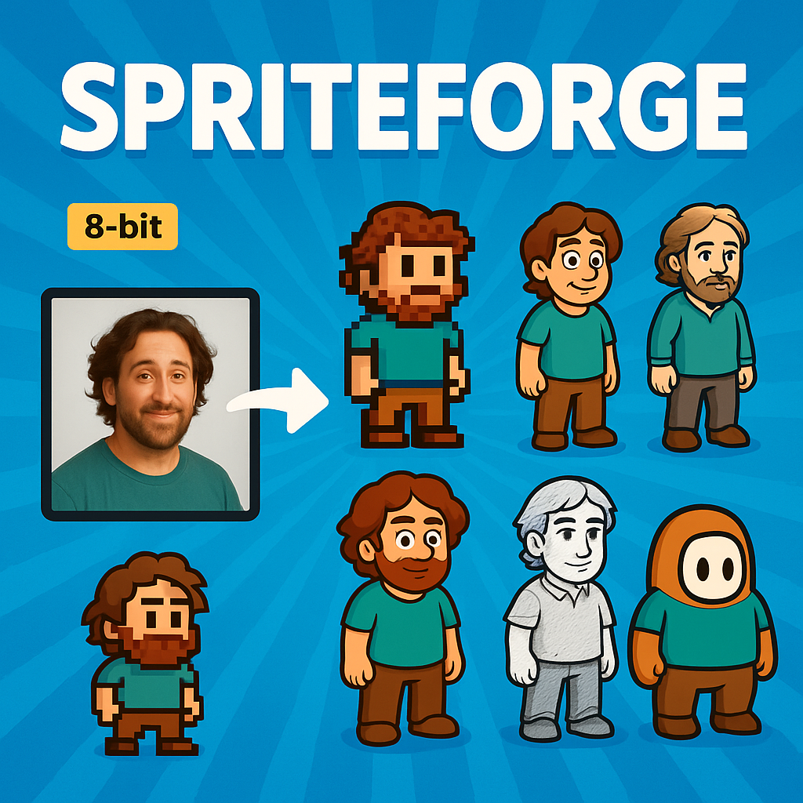
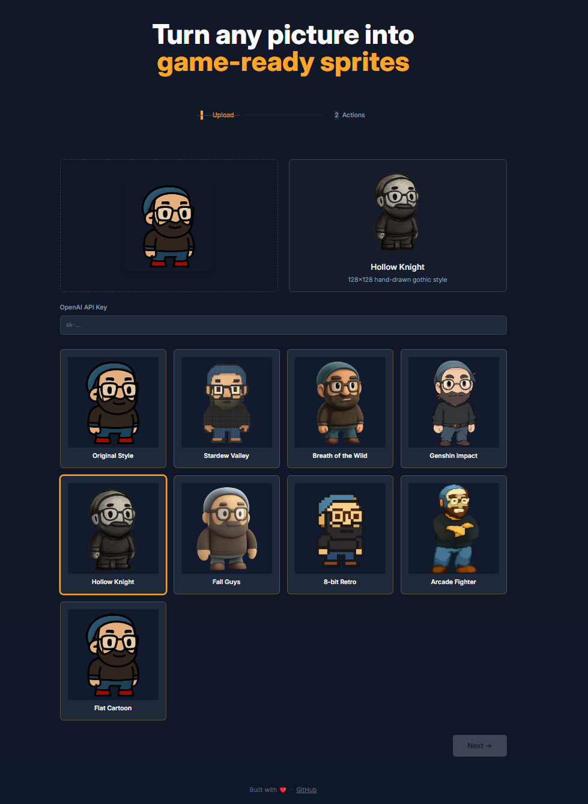
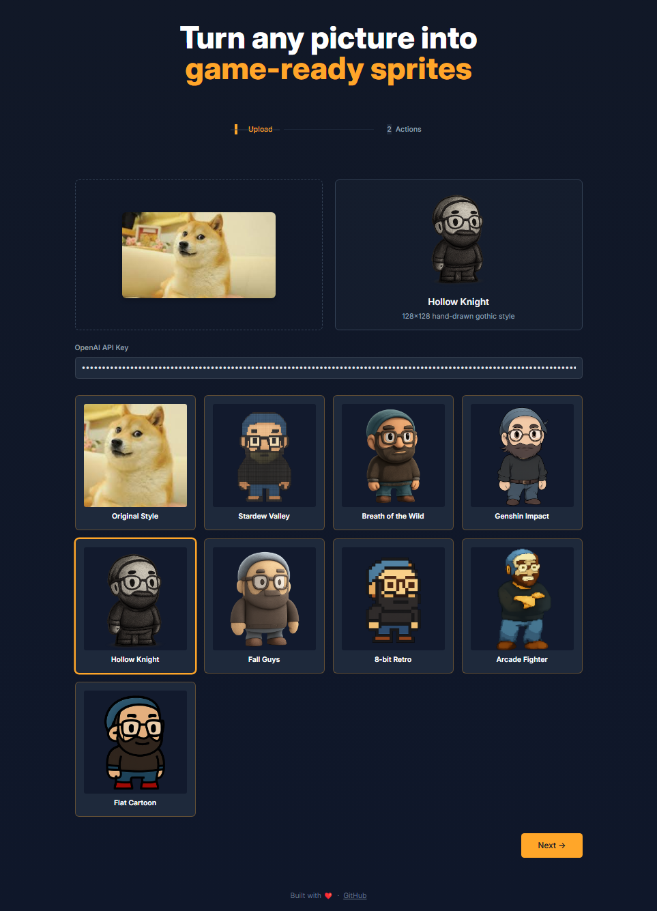
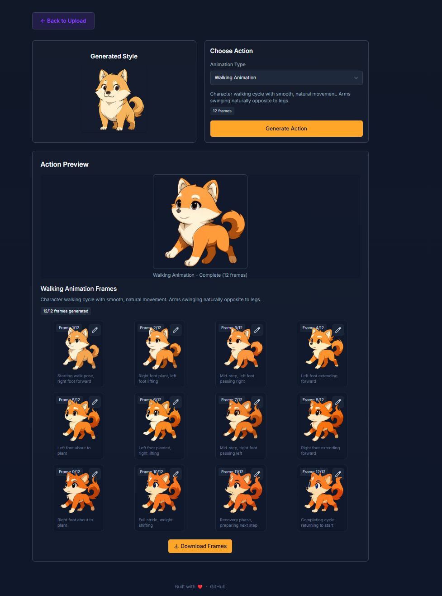

# SpriteForge

<div align="center">
  
  <p><em>Generate professional game sprites from photos using OpenAI's GPT-Image-1 model</em></p>
</div>

## 🎮 Overview

SpriteForge is a web application that transforms regular photos into game-ready character sprites using OpenAI's GPT-Image-1 model. Whether you're a game developer looking for quick character assets or just someone who wants to see themselves as a video game character, SpriteForge makes it easy to generate high-quality sprites in various popular game styles.

## ✨ Features

- **Multiple Game Styles**: Generate sprites in various popular game styles:
  - Stardew Valley (32×32 pixelart)
  - Breath of the Wild (256×256 cel-shaded)
  - Genshin Impact (192×192 anime-styled)
  - Hollow Knight (128×128 hand-drawn gothic)
  - Fall Guys (160×160 bouncy cartoon)
  - Original style based on your reference image

- **Animation Actions**: Create multiple animation sequences for your character:
  - Idle animation
  - Walk cycle
  - Jump animation
  - Air attack
  - Hurt animation
  - Knockout animation
  - Punch combinations
  - Turn around animation

- **Real-time Preview**: Watch animations come to life with our built-in animation player
- **Frame Editing**: Edit and regenerate individual frames for perfect animations
- **Direct API Integration**: Uses your own OpenAI API key for image generation

## 🖼️ Example Output

<div align="center">
  
  <p><em>Example sprite sheet generated with SpriteForge</em></p>
</div>

## 📸 Screenshots

<div align="center">
  
  <p><em>Upload your image and select style preferences</em></p>
  
  
  <p><em>Choose from multiple generated game styles</em></p>
  
  
  <p><em>Preview and customize your animated sprite frames</em></p>
</div>

## 🚀 Getting Started

### Prerequisites

- Node.js (v16+)
- npm or yarn
- OpenAI API key with access to GPT-Image-1 model

### Installation

1. Clone the repository:
   ```bash
   git clone https://github.com/marcelontime/spriteforge.git
   cd spriteforge
   ```

2. Install dependencies:
   ```bash
   npm install
   ```

3. Build the styles:
   ```bash
   npm run build
   ```

4. Start the development server:
   ```bash
   npm run dev
   ```

5. Open your browser to http://localhost:8080

## 🎮 How to Use

1. **Enter your OpenAI API key** (required for image generation)
2. **Upload a reference photo** (preferably a full-body image with a clear subject)
3. **Generate Style Previews** to see your character in different game styles
4. **Select your preferred style** from the generated options
5. **Choose an animation action** from the dropdown menu
6. **Generate your sprite frames** and watch them animate in real-time
7. **Edit individual frames** if needed by clicking on them
8. **Download your completed sprite sheet** for use in your games!

## 🛠️ Technical Details

### Technology Stack

- **Frontend**: HTML5, CSS3, JavaScript, Tailwind CSS
- **API Integration**: OpenAI GPT-Image-1 model
- **Build Tools**: PostCSS, Nodemon, Concurrently
- **Deployment**: GitHub Pages

### API Usage Notes

- This application uses OpenAI's GPT-Image-1 model which requires an API key
- API calls are made directly from your browser to OpenAI
- Your API key is stored in localStorage for convenience but never sent to our servers
- Image generation costs will be charged to your OpenAI account

## 🔒 Privacy

- Your uploaded images are processed entirely in your browser
- No data is transmitted to any server except directly to OpenAI's API
- Your OpenAI API key is stored locally and only used to authenticate with OpenAI

## 🤝 Contributing

Contributions are welcome! Please feel free to submit a Pull Request.

1. Fork the repository
2. Create your feature branch (`git checkout -b feature/amazing-feature`)
3. Commit your changes (`git commit -m 'Add some amazing feature'`)
4. Push to the branch (`git push origin feature/amazing-feature`)
5. Open a Pull Request

## 📄 License

This project is licensed under the MIT License - see the LICENSE file for details.

## 🙏 Acknowledgements

- OpenAI for providing the image generation API
- All the game art styles that inspired this project
- Contributors who have helped improve this tool 